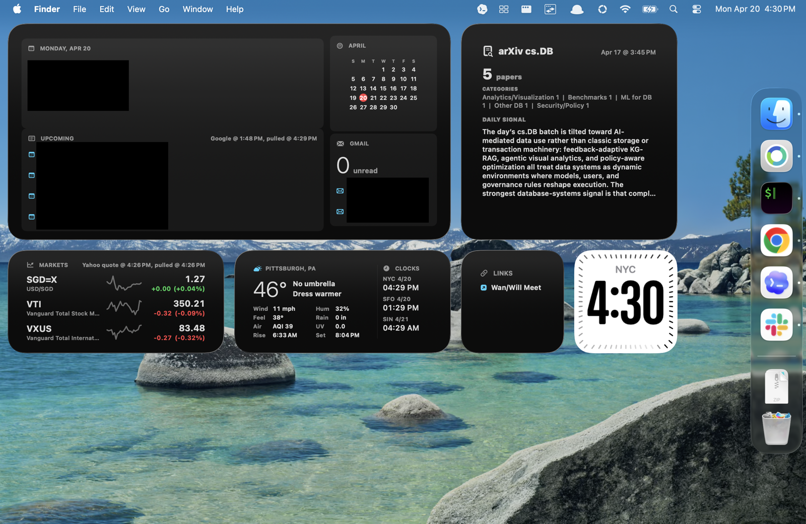

# KapiBoard

Warning: completely vibe coded for personal use.

Thanks to codex desktop, I'm finally back on the macOS ecosystem.
Somehow, Tahoe desktop widgets are even worse than Rainmeter on Windows 7, so here we are.



Google OAuth2 goes in `~/.kapiboard/google.json`:

```
{
  "googleClientID": "CLIENT_ID",
  "googleClientSecret": "CLIENT_SECRET"
}
```

Everything else is configured through more vibecoding.

